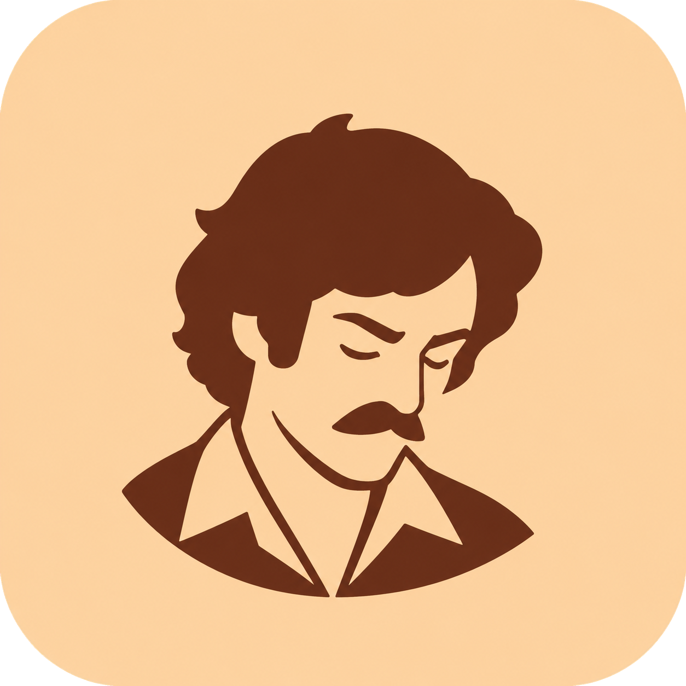

# Lofitime



[](https://github.com/t1llo/lofitime/actions/workflows/build.yml)
[](https://github.com/t1llo/lofitime/releases/latest)


**A little music. A little more focus.** A native macOS menu-bar app for lo-fi radio and Pomodoro timers, built with SwiftUI.

[Website](https://lofi.beffa.xyz) · [Download for Mac](https://github.com/t1llo/lofitime/releases/latest)

## Install

Requires **macOS 14 or later**. Open the DMG and drag **Lofitime.app** into **Applications**. Releases support Apple Silicon and Intel Macs and are signed and notarized.

## Screenshots


## Features

- **Live lo-fi radio:** Chill house (default), Study lo-fi, Sleepy lo-fi, and Synthwave.
- **Focus timers:** customizable Pomodoro cycles and editable countdowns.
- **Focus forest:** short sessions grow a varied forest of flowers, tall trees, and animated wildlife across three weeks of daily squares. Hover for daily focus time, click for sessions, and scroll or pinch to zoom. Planting stays consistent and session history stays saved locally.
- **Native macOS:** a compact studio, menu-bar player, two themes, and completion notifications.
- **Convenience:** launch at login, automatic updates, and optional automatic breaks.
- **Video quality:** choose an available resolution through YouTube's player in Settings.

## Using Lofitime

Choose a station and press **Play music**, or **Start focus** to begin a timer. Music and timers work independently; closing the studio keeps Lofitime in your menu bar.

Enter `45` or `25:30` into a paused countdown to change its duration. Open **Activity** for completed sessions and **Settings** for timer defaults, themes, and startup preferences. Radio playback requires an internet connection.

## Build from source

Requires **Swift 6+** and recent Apple Command Line Tools or Xcode. Swift Package Manager downloads dependencies on the first build.

```sh
xcode-select --install # If developer tools are not already installed
make run
```

The app is built at **`build/Lofitime.app`**. Local builds use an ad-hoc signature.

| Command | What it does |
| --- | --- |
| `make check` | Test, build, and verify the app bundle |
| `make dev` | Launch a debug build |
| `make smoke` | Check native controls and live playback |
| `make preview` | Save screenshots to `build/previews/` |
| `make help` | List commands |

GitHub Actions checks builds and scans Git history with Gitleaks on every push and pull request. Smoke tests require internet and a logged-in desktop session; they use isolated settings and play briefly at 1% volume.

## Keyboard shortcuts

| Shortcut | Action |
| --- | --- |
| `⌘ Return` | Start / pause / resume the timer |
| `⌘ ⇧ P` | Play / pause music |
| `⌘ ⇧ R` | Reset the current session |
| `⌘ 1` | Open the studio |
| `⌘ 2` | View activity |
| `⌘ ,` | Open settings |
| `⌘ Q` | Quit |

## Third-party notices

See [ATTRIBUTION.md](ATTRIBUTION.md) for media ownership and dependency notices.
